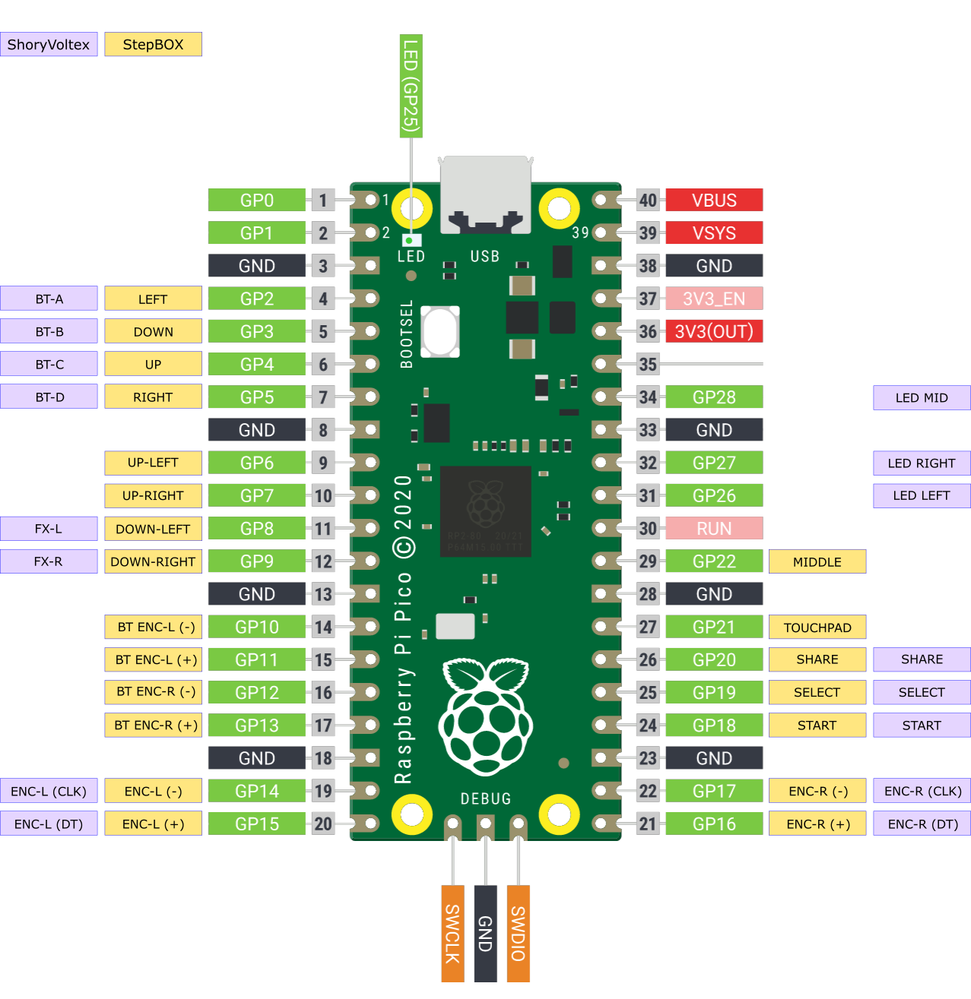

# StepBOX Firmware

StepBOX is a custom rhythm gamepad based on the RP2040 (Raspberry Pico) microcontroller. The gamepad is recognized through DirectInput Driver on Windows, Mac & Linux.

## Layout

The layout was designed with 13 face buttons + 4 auxiliaries ones (touch, share, select and start)

```
                       [14] [15] [16] [17]
▛▝▝▝▝▝▝▝▝▝▝▝▝▝▝▝▝▝▝▝▝▝▝▝▝▝▝▝▝▝▝▝▝▝▝▝▝▝▝▝▝▜
▘                                        ▝
▘    [1]  [2]   [3]   [4]    [5]  [6]    ▝
▘                                        ▝
▘      [7]  [8]    [9]    [10]  [11]     ▝
▘                                        ▝
▘              [12]   [13]               ▝
▘                                        ▝
▙▖▖▖▖▖▖▖▖▖▖▖▖▖▖▖▖▖▖▖▖▖▖▖▖▖▖▖▖▖▖▖▖▖▖▖▖▖▖▖▖▟
```

## Layout by Game

These are our layout recommendations (per lanes) for the following games

- **Dance Dance Revolution** ( StepMania )

```
                               ⚪ ⚪ ⚪ ⚪
▛▝▝▝▝▝▝▝▝▝▝▝▝▝▝▝▝▝▝▝▝▝▝▝▝▝▝▝▝▝▝▝▝▝▝▝▝▝▝▝▝▜
▘                                        ▝
▘      ⚪  ⚪   ⚪    ⚪    ⚪  ⚪       ▝
▘                                        ▝
▘        ⚫  ⚫    ⚪    ⚫  ⚫          ▝             Left - Down - Up - Right
▘                                        ▝
▘               ⚪    ⚪                 ▝                  [Back] - [Enter]
▘                                        ▝
▙▖▖▖▖▖▖▖▖▖▖▖▖▖▖▖▖▖▖▖▖▖▖▖▖▖▖▖▖▖▖▖▖▖▖▖▖▖▖▖▖▟

```

- **Pump It Up** ( StepPrime )

```
                               ⚪ ⚪ ⚪ ⚪
▛▝▝▝▝▝▝▝▝▝▝▝▝▝▝▝▝▝▝▝▝▝▝▝▝▝▝▝▝▝▝▝▝▝▝▝▝▝▝▝▝▜
▘                                        ▝
▘      ⚪  ⚪   ⚫    ⚫    ⚪  ⚪       ▝                Up-Left  -  Up-Right
▘                                        ▝
▘        ⚪  ⚪    ⚫    ⚪  ⚪          ▝                      Center
▘                                        ▝
▘               ⚫    ⚫                 ▝               Down-Left -  Down-Right
▘                                        ▝
▙▖▖▖▖▖▖▖▖▖▖▖▖▖▖▖▖▖▖▖▖▖▖▖▖▖▖▖▖▖▖▖▖▖▖▖▖▖▖▖▖▟
```

- **Sound Voltex** ( KShootMania, unnamed-sdvx-clone )

```
                               ⚪ ⚪ ⚪ ⚪
▛▝▝▝▝▝▝▝▝▝▝▝▝▝▝▝▝▝▝▝▝▝▝▝▝▝▝▝▝▝▝▝▝▝▝▝▝▝▝▝▝▜
▘                                        ▝
▘      ⚫  ⚫   ⚪    ⚪    ⚫  ⚫       ▝   VOL-L                                   VOL-R
▘                                        ▝
▘        ⚫  ⚫    ⚪    ⚫  ⚫          ▝       BT-A    BT-B   [START]   BT-C    BT-D
▘                                        ▝
▘               ⚫    ⚫                 ▝           FX-L                     FX-R
▘                                        ▝
▙▖▖▖▖▖▖▖▖▖▖▖▖▖▖▖▖▖▖▖▖▖▖▖▖▖▖▖▖▖▖▖▖▖▖▖▖▖▖▖▖▟
```

## Features

- Selectable input modes (DirectInput, DirectInput + Keyboard)
- 17 full re-assignable buttons
- Less than 1 ms of input latency

## Input Modes

The default input mode replicates the behavior of a gamepad with 4 hats and 17 buttons. During the development of the StepBOX, we faced across a scenario where in _KShootMania_ buttons `1` `2` `5` `6` can be set as left and right lasers normally but in _unnamed-sdvx-clone_ it requires a real knob.

We get around this problem by implementing a composite-device that behaves both as a gamepad and as a keyboard. In this way, when activating **Keyboard Mode** some buttons also triggers some ASCII keys:

```
[1] -> W
[2] -> E

[5] -> O
[6] -> P
```

#### How to enable Keyboard Mode

1. Unplug your StepBOX from USB;
1. Hold the button `16` (Select) and plug your device again;
1. The onboard LED should be on indicating the new mode.

## Installation

Prebuilt `uf2` files are available in the [Releases](https://github.com/shorygame/StepBOX/releases) section for the following boards and controllers:

- ~~[Shory Board]()~~ (**not available yet**)
- [Raspberry Pi Pico]() and other RP2040 boards

Instructions for a Raspberry Pi Pico.

1. Download the latest `StepBOX.uf2` file from the [Releases](https://github.com/shorygame/StepBOX/releases) section for your board (e.g. `StepBOX-RaspberryPiPico.uf2` for the Raspberry Pi Pico);
1. Unplug your Pico;
1. Hold the BOOTSEL button on the Pico and plug into your computer. A new removable drive named `RPI-RP2` should appear in your file explorer;
1. Drag and drop the `StepBOX.uf2` file into the removable drive. This will flash the board.
1. The board is now running the StepBOX firmware and will appear as a controller on your computer.

## Wiring Diagram



## Support

If you like to discuss features, issues or anything else related to Shory products please [create an issue](https://github.com/shorygame/StepBOX/issues/new) or join the [Shory Discord Channel](https://discord.gg/kGekqHdRrn).
